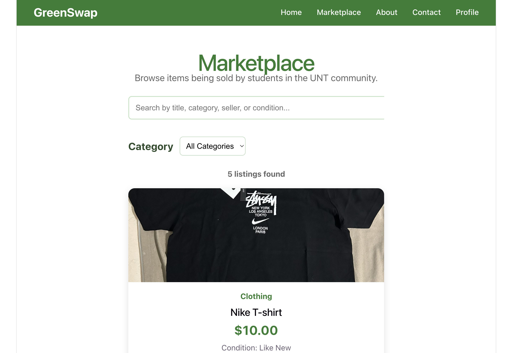
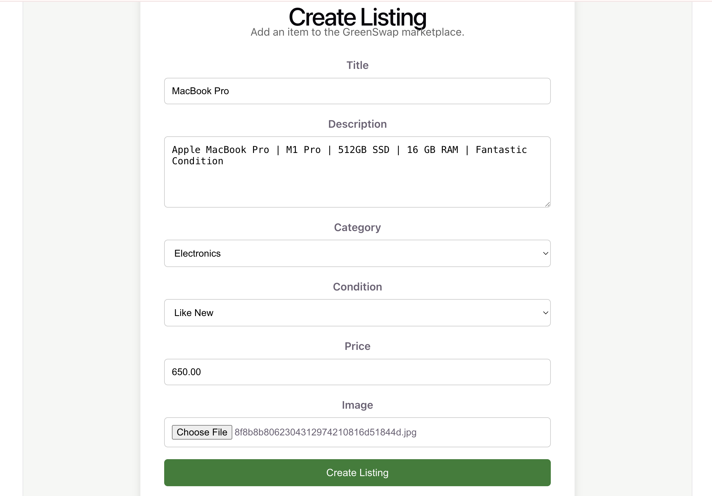
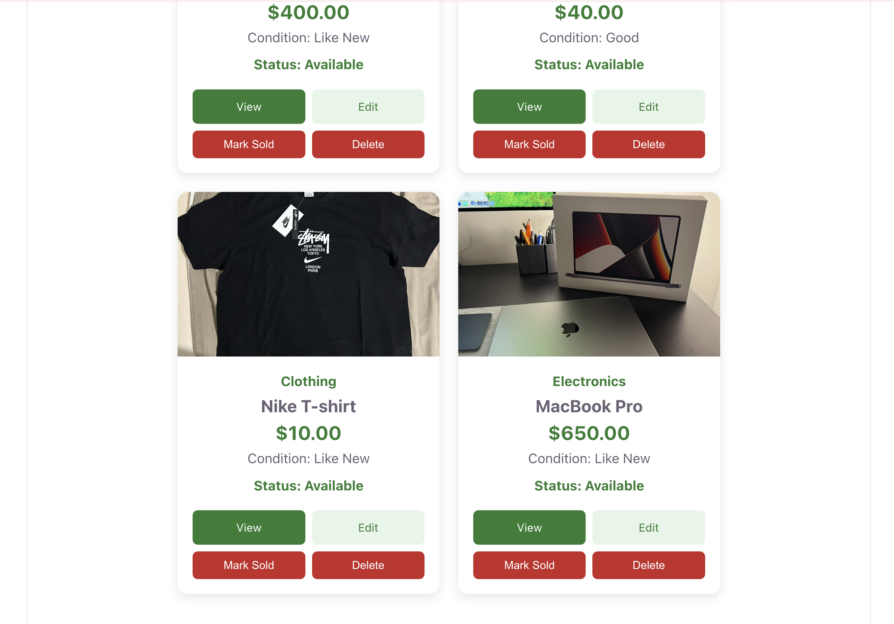
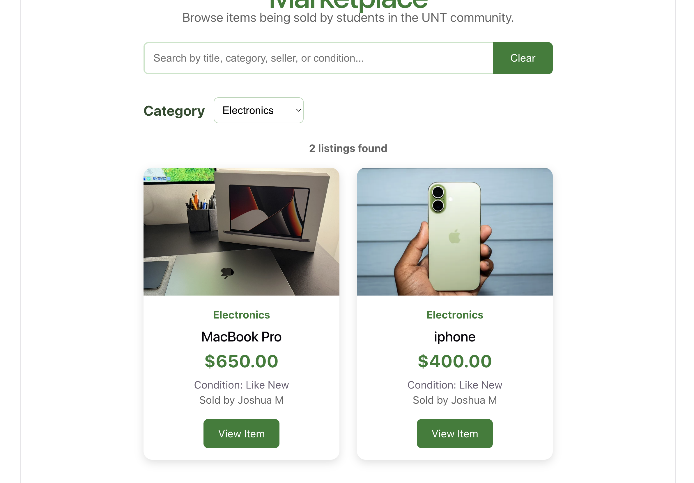

# GreenSwap

GreenSwap is a web based marketplace exclusively for the UNT community. Verified students, faculty, and staff can buy and sell secondhand items including textbooks, furniture, electronics, clothing, and more.

**Tech Stack:** React * Django REST Framework * PostgreSQL

---

## Demo


*Browse and filter active listings*


*Post an item with photo, price, and condition*


*Manage your own listings. Mark sold, relist, or delete*


*Filter listings based on category*

---
## Overview

Many students resort to Facebook Marketplace or other public platforms to buy and sell items. GreenSwap addresses this by providing a members-only marketplace restricted to solely verified UNT email holders, making every transaction safer and more trusted within the campus community.

---

## Features

- **UNT-verified registration**: accounts restricted to '@my.unt.edu'/'@unt.edu' emails
- **JWT authentication**: token-based login with password reset
- **Listings management**: create, edit, delete, and mark items as sold
- **Browse, search & filter**: find listings by keyword, category, condition, and price range
- **User profiles** - editable profiles with secure image upload
- **Ownership-based authorization** - users can only modify their own listings

---

## Security 
Security was a core focus throughout the app's development, built into each decision: 

- **Authorization checks** - users can only edit or delete listings they own
- **User enumeration defense** -login returns generic errors so attacks can't distinguish valid from invalid accounts
- **Rate limiting** - login attempts are limited to defend against brute-force attacks
- **Secure file uploads** - uploaded images are validated by actual file content (not just filename or extension), rejecting malicious files disguised.
- **Password hashing** - passwords are hashed, never stored in plaintext
- **Single-use, time-sensitive tokens** - email verification and password reset tokens are secure, single-use, and time-limited

---

## Tech Stack

| Layer | Technology |
|-------|-----------|
| Frontend | React (Vite) |
| Backend | Django REST Framework |
| Database | PostgreSQL |
| Auth | JWT (djangorestframework-simplejwt) |

---

## Getting Started

## Prerequisites
- Python 3.10+
- Node.js 18+
- Postgre SQL

### Backend setup
```bash
cd backend
python3 -m venv venv
source venv/bin/activate
pip install -r requirements.txt
cp .env.example .env        # add your database credentials
python manage.py migrate
python manage.py runserver
```

### Frontend Setup
```bash
cd frontend
npm install
npm run dev
```

The frontend runs at `http://localhost:5173` and the backend API at `http://localhost:8000`.

---

##  API Overview

| Endpoint | Method | Description |
|----------|--------|-------------|
| `/api/register/` | POST | Register with a UNT email |
| `/api/verify/` | GET | Verify email via token |
| `/api/login/` | POST | Authenticate, receive JWT |
| `/api/token/refresh/` | POST | Refresh JWT access token |
| `/api/password-reset/` | POST | Request a password reset |
| `/api/password-reset/confirm/` | POST | Confirm password reset with token |
| `/api/profile/` | GET/PATCH | View or edit profile |
| `/api/profile/picture/` | POST | Upload profile picture |
| `/api/profile/listings` | GET | View your own listings |
| `/api/listings/` | GET | Browse, search, and filter listings |
| `/api/listings/create/` | POST | Create a listing |
| `/api/listings/<id>/` | PATCH/DELETE | Edit, mark sold, or delete (owner only) |

---

## Future plans

- In-app buyer-seller messaging
- Notifications
- Admin moderation tools

---

## Author 

Built by Joshua Moreno - [GitHub](https://github.com/Joshuam2005) 

*Built as part of CSCE 3444 (Software Engineering) at the University Of North Texas.*
